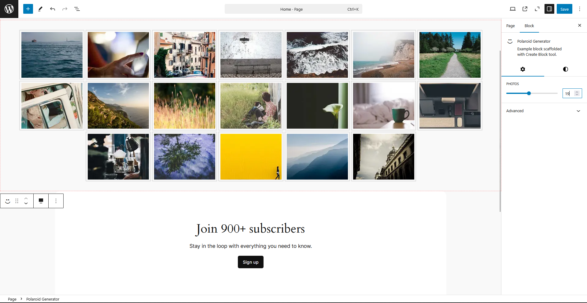

# Polaroid Generator Gutenberg Block

A customizable WordPress Gutenberg block that generates a grid of polaroid-style images. Images are dynamically sourced from **Picsum Photos** and can be adjusted using the block's editing panel. Includes lazy loading, a responsive layout, and easy customization.

## Features

- **Customizable grid of polaroid-style images**.
- **Adjustable number of photos** via the block’s settings panel.
- **Responsive layout** that adapts to different screen sizes.
- **Lazy loading** for improved performance.
- Uses **Picsum Photos** for random images.
- Easy-to-use block editor integration with the WordPress Gutenberg editor.

## Installation

### Manual Installation

1. Download or clone this repository.
2. Upload the plugin folder to your WordPress `wp-content/plugins` directory.
3. Go to the **WordPress Admin Panel** > **Plugins** and activate the **Polaroid Generator** plugin.

### Usage

1. In the WordPress block editor, add a new **Polaroid Generator** block to your post or page.
2. In the block settings panel, use the **Range Control** to adjust the number of images to display.
3. The block will automatically pull random images from **Picsum Photos** and display them in a responsive grid.
4. You can also adjust the appearance by editing the block's CSS and settings.

## Screenshots

### 1. Editing Panel (Block Settings)

This is the block settings panel where users can adjust the number of polaroid images to display.

### 2. Frontend Panel (Block Display)

This shows how the Polaroid Generator block will look on the frontend of the site, displaying a grid of polaroid-style images.

## Changelog

### 0.1.0
- Initial release of the Polaroid Generator Gutenberg Block.
- Allows for dynamic generation of a polaroid image grid.
- Images are sourced from Picsum Photos.
- Supports lazy loading and responsive design.

## License

This plugin is licensed under the **GPL2+ License**.

## Author

**Md. Anik** 
